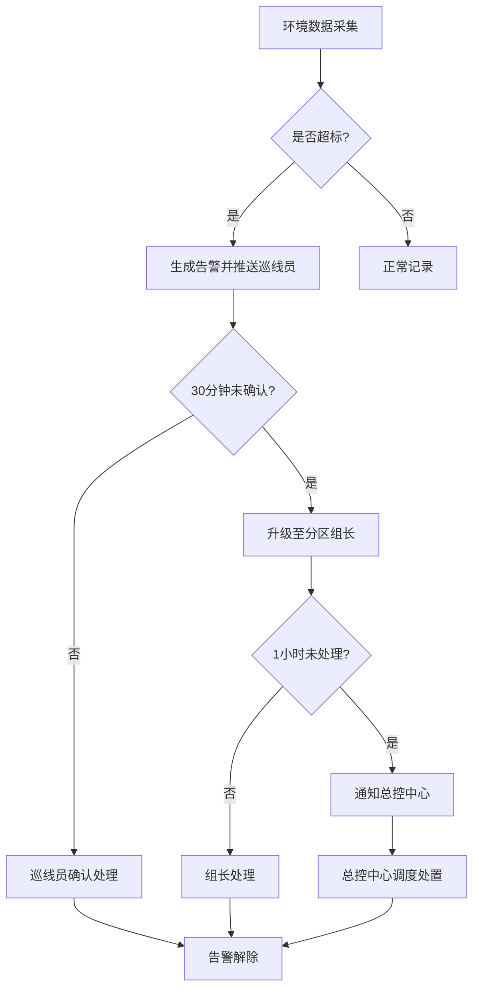

## 1. 产品概述

大型城市地下综合管廊智慧管理平台，实现管廊分区管理、环境实时监测、设备远程控制、智能巡检、多级报警升级、工单全流程管理和数据可视化大屏展示，全面提升管廊运维管理效率与安全性。

- 核心目标：通过信息化、智能化手段实现管廊运维的全生命周期管理，降低安全风险，提高响应效率
- 目标用户：管廊运维巡线员、分区组长、总控中心操作员、系统管理员

## 2. 核心功能

### 2.1 用户角色

| 角色 | 注册方式 | 核心权限 |
|------|----------|----------|
| 巡线员 | 管理员创建 | 查看负责区域，执行巡检任务，上报隐患，处理 assigned 工单 |
| 分区组长 | 管理员创建 | 管理本分区所有事务，处理升级告警，审批工单，查看本分区数据 |
| 总控中心 | 管理员创建 | 跨分区监控全局数据，处理高级别告警，调度资源，查看全区域报表 |
| 管理员 | 系统初始化 | 全局配置管理，用户权限管理，报警规则配置，巡检规则配置，系统设置 |

### 2.2 功能模块

1. **首页大屏**：实时监控总览、分区环境达标率、设备运行状态、巡检完成率、24小时告警热力图、数据5秒自动刷新
2. **分区管理**：分区信息登记（长度、管线类型、断面尺寸）、分区通行权限管理、分区状态监控
3. **环境监测**：温湿度、氧气、甲烷、硫化氢实时数据采集、超标自动告警、联动通风/排水设备
4. **设备管理**：照明、水泵、风机、消防设备远程控制、设备状态监控、故障自动报修
5. **巡检管理**：预设巡检路线、自动生成巡检任务、扫码打卡、隐患拍照上传、整改工单生成
6. **报警管理**：多级报警升级机制、告警推送、告警确认、告警历史查询
7. **工单管理**：维修/整改工单自动生成、按紧急程度指派、接单超时升级、工单处置、材料消耗记录、修复照片上传
8. **报表中心**：月度运维分析报告、工单处置明细、按分区/日期筛选、一键导出Excel/PDF
9. **系统管理**：用户管理、角色权限配置、报警规则设置、巡检规则配置

### 2.3 页面详情

| 页面名称 | 模块名称 | 功能描述 |
|----------|----------|----------|
| 首页大屏 | 监控总览 | 分区环境达标率环形图、设备状态统计、巡检完成率进度、告警热力图、实时告警滚动条、关键指标卡片 |
| 分区管理 | 分区列表 | 分区信息表格、新增/编辑/删除分区、搜索筛选、批量操作 |
| 分区管理 | 分区详情 | 分区基本信息、环境数据趋势、设备列表、通行权限开关 |
| 环境监测 | 实时监测 | 各分区实时数据卡片、超标告警标识、数据曲线图、设备联动控制按钮 |
| 环境监测 | 历史数据 | 按时间范围查询、多参数对比曲线、数据导出 |
| 设备管理 | 设备列表 | 设备分类筛选、运行状态标识、远程一键控制（开关）、故障标记 |
| 设备管理 | 设备详情 | 设备基本信息、运行日志、控制历史、关联工单 |
| 巡检管理 | 巡检任务 | 任务列表、任务状态（待执行/进行中/已完成/超期）、扫码打卡入口 |
| 巡检管理 | 隐患上报 | 隐患描述、照片上传、自动生成整改工单 |
| 报警管理 | 实时告警 | 告警列表、等级标识、确认按钮、升级状态显示、批量处理 |
| 报警管理 | 告警历史 | 多条件筛选、告警趋势分析、导出功能 |
| 工单管理 | 工单列表 | 工单类型（维修/整改）、紧急程度、指派状态、处理进度、超时提醒 |
| 工单管理 | 工单详情 | 工单信息、处置记录、材料消耗登记、修复照片上传、状态流转 |
| 报表中心 | 运维报告 | 月度管廊运维分析、图表展示、导出PDF |
| 报表中心 | 工单明细 | 按分区/日期筛选、处置统计、导出Excel |
| 系统管理 | 用户管理 | 用户增删改查、角色分配、状态管理 |
| 系统管理 | 规则配置 | 报警阈值设置、巡检路线配置、升级时间规则设置 |

## 3. 核心流程

### 3.1 告警升级流程

环境监测数据超标 → 自动生成一般告警 → 推送至当班巡线员 → 30分钟未确认 → 升级至分区组长 → 1小时未处理 → 通知总控中心 → 总控中心调度处置 → 告警解除

### 3.2 工单处置流程

设备故障/隐患上报 → 自动生成工单 → 按紧急程度指派人员 → 2小时未接单 → 升级至主管 → 接单处理 → 上传修复照片和材料消耗 → 系统更新设备状态 → 工单完成

### 3.3 巡检工作流程

系统按预设路线自动生成巡检任务 → 巡线员接收任务 → 扫码打卡 → 沿路线检查 → 发现渗漏/裂缝等隐患 → 拍照上传 → 系统自动生成整改工单 → 超期未整改 → 暂停该分区通行权限 → 整改完成 → 恢复权限

## 4. 用户界面设计

### 4.1 设计风格

- **主色调**：深蓝色 #0A2463（专业、科技、可靠），搭配青色 #3E92CC 作为强调色
- **辅助色**：告警红色 #D62828、警告橙色 #F77F00、成功绿色 #00A896、信息蓝色 #0466C8
- **背景色**：深色主题 #0F172A 配合渐变，营造大屏监控的专业感
- **按钮风格**：微圆角、立体阴影、hover时有光效过渡
- **字体**：标题使用 Noto Sans SC Bold，正文使用 Noto Sans SC Regular，数字等宽字体使用 JetBrains Mono
- **布局风格**：卡片式布局、网格系统、分区明确、数据密度适中
- **图标风格**：线性图标搭配填充，统一2px描边，告警类图标使用脉冲动画

### 4.2 页面设计概览

| 页面名称 | 模块名称 | UI元素 |
|----------|----------|--------|
| 首页大屏 | 监控总览 | 深色背景、顶部导航栏、左侧分区树、中间核心指标卡片组、右侧告警滚动面板、下方热力图区域、数据刷新动画、数字滚动效果 |
| 环境监测 | 实时监测 | 数据卡片带渐变边框、实时曲线图带光晕效果、超标数据红色闪烁动画、设备控制面板带开关切换动效 |
| 报警管理 | 实时告警 | 告警条目按等级染色、新告警滑入动画、确认按钮脉冲提示、升级进度条 |
| 工单管理 | 工单详情 | 时间线式处置记录、照片预览轮播、材料消耗表格、状态流转步骤条 |

### 4.3 响应式

- 桌面端优先设计，针对1920×1080及以上分辨率优化
- 首页大屏支持全屏模式（F11），适配监控大屏展示
- 侧边栏可折叠，适配不同屏幕宽度
- 表格支持横向滚动，保证小屏设备可查看完整数据

### 4.4 动效设计

- 页面加载：元素渐入+轻微上移动画，按区域错开时间
- 数据刷新：数字平滑过渡（countUp效果），图表线条重绘动画
- 告警出现：右侧滑入+红色边框脉冲闪烁
- 按钮交互：hover时背景色渐变+轻微放大，点击时收缩反馈
- 状态切换：开关切换滑动动画，状态标签颜色过渡
