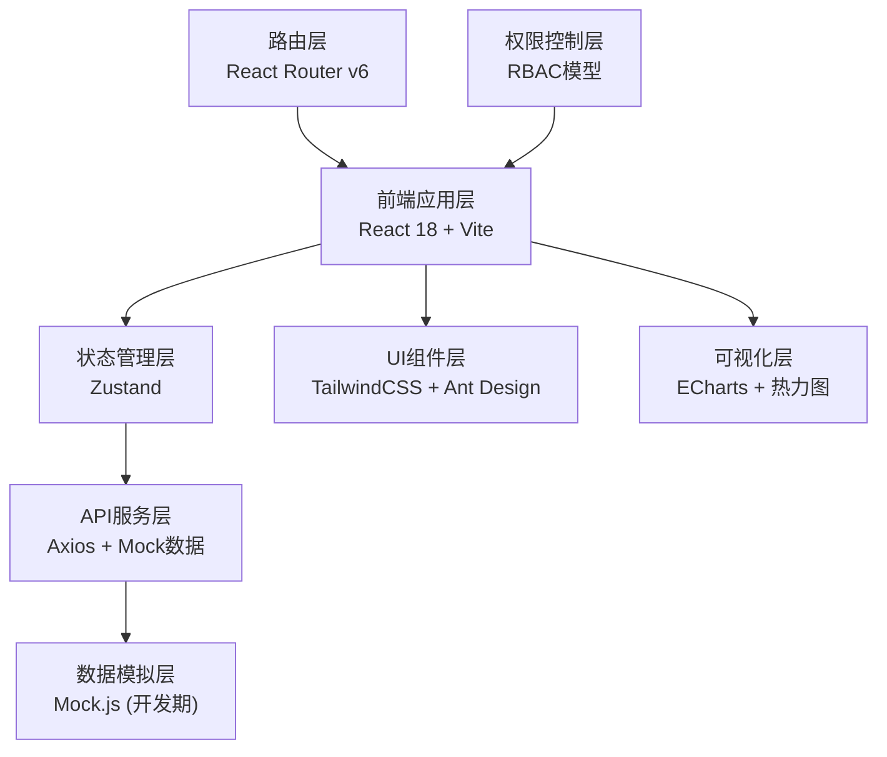
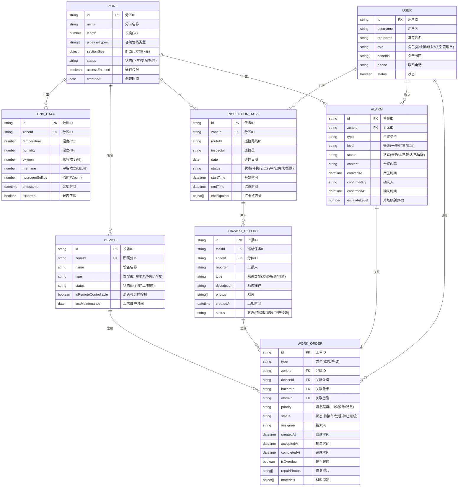

## 1. 架构设计



## 2. 技术选型说明

- **前端框架**: React 18 + TypeScript，采用函数式组件+Hooks开发模式
- **构建工具**: Vite 5.x，提供快速热更新和构建性能
- **UI框架**: TailwindCSS 3.x 原子化CSS + Ant Design 组件库
- **状态管理**: Zustand，轻量级状态管理，支持持久化
- **图表可视化**: ECharts 5.x，支持折线图、饼图、热力图等多种图表
- **路由管理**: React Router v6，支持嵌套路由和路由守卫
- **HTTP客户端**: Axios，封装统一请求拦截和响应处理
- **数据模拟**: Mock.js，开发阶段模拟后端接口数据
- **工具库**: dayjs (日期处理)、lodash (工具函数)、xlsx (Excel导出)、jspdf (PDF导出)

## 3. 目录结构

```
src/
├── assets/              # 静态资源（图片、字体、图标）
├── components/          # 公共组件
│   ├── layout/         # 布局组件（侧边栏、顶部导航）
│   ├── charts/         # 图表组件封装
│   ├── common/         # 通用组件（按钮、卡片、表格等）
│   └── business/       # 业务组件（告警卡片、设备控制等）
├── pages/               # 页面组件
│   ├── dashboard/      # 首页大屏
│   ├── zone/           # 分区管理
│   ├── environment/    # 环境监测
│   ├── device/         # 设备管理
│   ├── inspection/     # 巡检管理
│   ├── alarm/          # 报警管理
│   ├── workorder/      # 工单管理
│   ├── report/         # 报表中心
│   └── system/         # 系统管理
├── store/               # 状态管理
│   ├── useUserStore.ts    # 用户信息
│   ├── useAlarmStore.ts   # 告警状态
│   ├── useDeviceStore.ts  # 设备状态
│   └── useZoneStore.ts    # 分区状态
├── api/                 # API接口
│   ├── index.ts        # 统一导出
│   ├── request.ts      # Axios封装
│   ├── mock/           # Mock数据
│   ├── zone.ts         # 分区相关接口
│   ├── environment.ts  # 环境监测接口
│   ├── device.ts       # 设备接口
│   ├── inspection.ts   # 巡检接口
│   ├── alarm.ts        # 告警接口
│   ├── workorder.ts    # 工单接口
│   └── system.ts       # 系统接口
├── types/               # TypeScript类型定义
│   ├── index.ts        # 统一导出
│   ├── zone.ts
│   ├── environment.ts
│   ├── device.ts
│   ├── inspection.ts
│   ├── alarm.ts
│   ├── workorder.ts
│   └── system.ts
├── utils/               # 工具函数
│   ├── auth.ts         # 权限判断
│   ├── date.ts         # 日期处理
│   ├── export.ts       # 导出功能
│   └── format.ts       # 格式化函数
├── hooks/               # 自定义Hooks
│   ├── useWebSocket.ts # WebSocket连接（模拟实时数据）
│   ├── useRefresh.ts   # 定时刷新
│   └── usePermission.ts # 权限校验
├── router/              # 路由配置
│   ├── index.tsx       # 路由定义
│   └── guard.tsx       # 路由守卫
├── styles/              # 全局样式
│   ├── index.css       # 全局样式+Tailwind
│   ├── variables.css   # CSS变量
│   └── animations.css  # 动画样式
├── App.tsx              # 根组件
└── main.tsx             # 入口文件
```

## 4. 路由定义

| 路由路径 | 页面名称 | 权限要求 | 说明 |
|----------|----------|----------|------|
| /login | 登录页 | 无 | 用户登录入口 |
| /dashboard | 首页大屏 | 所有登录用户 | 实时监控总览 |
| /zone/list | 分区列表 | 分区组长及以上 | 分区管理 |
| /zone/detail/:id | 分区详情 | 分区组长及以上 | 单个分区详情 |
| /environment/realtime | 实时监测 | 所有登录用户 | 环境实时数据 |
| /environment/history | 历史数据 | 分区组长及以上 | 历史数据查询 |
| /device/list | 设备列表 | 分区组长及以上 | 设备管理和控制 |
| /device/detail/:id | 设备详情 | 分区组长及以上 | 设备详情和日志 |
| /inspection/tasks | 巡检任务 | 巡线员及以上 | 巡检任务列表 |
| /inspection/report | 隐患上报 | 巡线员及以上 | 隐患拍照上报 |
| /alarm/realtime | 实时告警 | 所有登录用户 | 实时告警列表 |
| /alarm/history | 告警历史 | 分区组长及以上 | 历史告警查询 |
| /workorder/list | 工单列表 | 巡线员及以上 | 工单管理 |
| /workorder/detail/:id | 工单详情 | 巡线员及以上 | 工单处置 |
| /report/operation | 运维报告 | 总控中心及以上 | 月度运维分析 |
| /report/workorder | 工单明细 | 总控中心及以上 | 工单处置明细 |
| /system/user | 用户管理 | 管理员 | 用户和角色管理 |
| /system/rule | 规则配置 | 管理员 | 报警和巡检规则 |

## 5. 数据模型定义

### 5.1 核心数据模型



### 5.2 模拟数据说明

- 预设8个管廊分区，每个分区包含不同类型的设备
- 环境监测数据每5秒模拟更新，包含随机波动
- 预设一定数量的历史告警和工单数据
- 模拟告警升级和工单超时逻辑

## 6. 核心功能实现方案

### 6.1 实时数据刷新
- 使用自定义Hook `useRefresh` 实现5秒定时刷新
- 模拟WebSocket实时推送效果
- 数据更新时使用数字滚动动画过渡

### 6.2 多级报警升级
- 定时器检查告警状态和持续时间
- 根据配置的升级规则自动提升告警等级
- 状态变更时触发通知效果

### 6.3 权限控制
- 路由级：通过路由守卫判断用户角色是否有权限访问
- 组件级：自定义Hooks `usePermission` 控制按钮/组件显示
- 数据级：根据用户角色过滤可见数据范围

### 6.4 报表导出
- Excel导出：使用 `xlsx` 库生成
- PDF导出：使用 `jspdf` + `html2canvas` 生成
- 支持按分区、日期范围筛选数据
